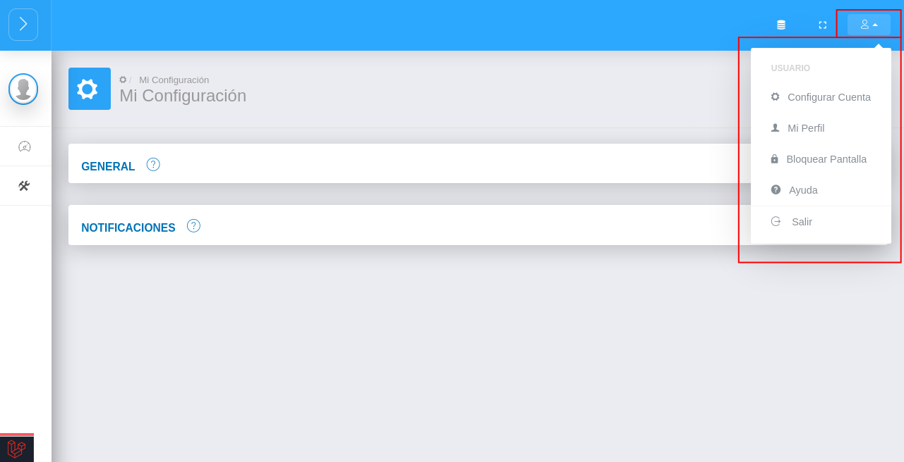
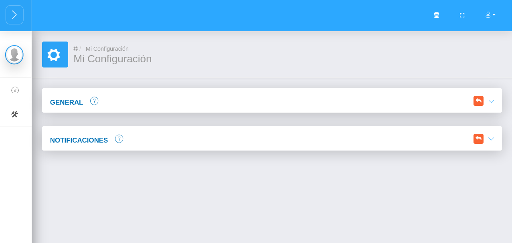
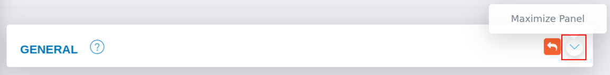
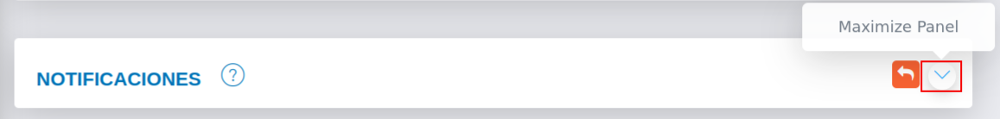
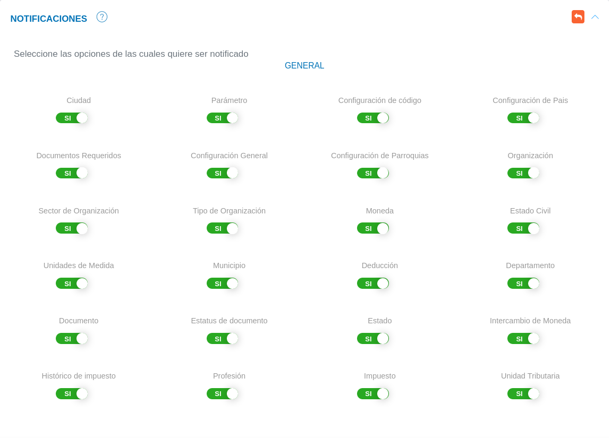
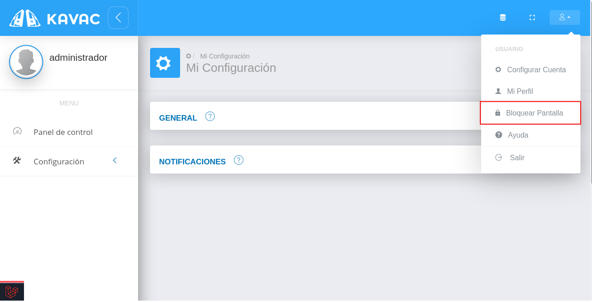
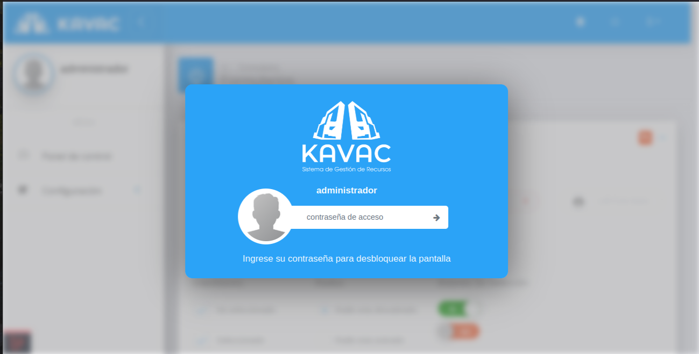
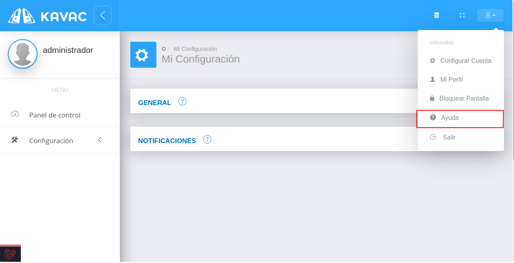
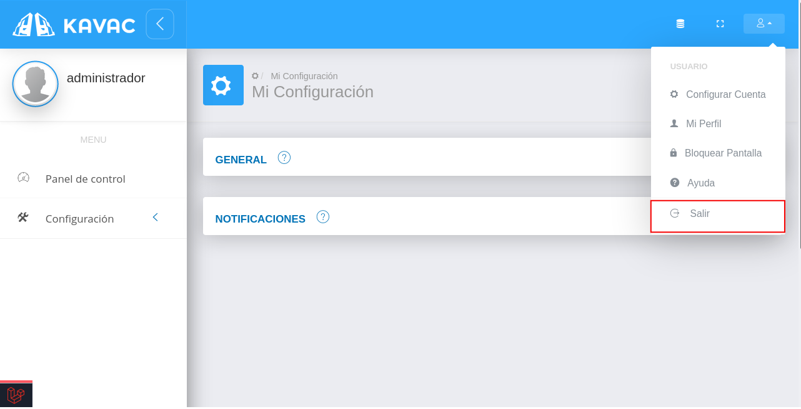

# Configuración de Cuenta de Usuario  
************************************

Una vez se ha iniciado sesión en el sistema se sugiere completar la configuración de cuenta de usuario para habilitar o deshabiltar funciones para la cuenta de usuario en gestión.

## Mi configuración y datos 

Para completar la configuración de cuenta de usuario se deben seguir los siguientes pasos: 

1)	Ingresar a la opción **Mi configuración y datos** haciendo clic sobre el **icono de usuario** ubicado en el panel superior del sistema.

!!! note ""
	**Icono de usuario**

	

Figura: Configuración de Cuenta de Usuario

2)	A continación se despliega un menú con las siguientes opciones: 

1.	***Configurar Cuenta.*** 

2.	***Mi Perfil.***  

3.	***Bloquear Pantalla.*** 

4.	***Ayuda.***

5.	***Salir.***
	
3)	Ingresar a la opción **Configurar Cuenta**.

### Configurar cuenta 

Figura: 

Al ingresar sobre la opción **Configurar cuenta** el sistema muestra dos secciones titulas **General** y **Notificaciones**.

Figura: Mi Configuración

#### General

- Presione el botón **Maximizar Panel**  para desplegar la sección **General**. 

Figura: Mi Configuración- General

En esta sección es posible habilitar o deshabilitar la funcionalidad para **Bloqueo de Pantalla**.

Figura: Configuración General

- Indique la opción  del botón de selección del campo **Activar** , si desea habilitar la opción de bloqueo de pantalla. 
- Indique la cantidad de minutos de inactividad para bloquear pantalla en el campo **Tiempo de inactividad**.  
- Presione el botón **Guardar**   para registrar los cambios efectuados.
- Presione el botón **Cancelar**   para cancelar registro y regresar a la ruta anterior.
- Presione el botón **Borrar**  para eliminar datos del formulario.
- Si desea recibir ayuda guiada presione el botón .
- Para retornar a la ruta anterior presione el botón .

#### Notificaciones

- Presione el botón **Maximizar Panel**  para desplegar la sección **Notificaciones**. 

Figura: Mi Configuración- Notificaciones

En esta sección es posible habilitar o deshabilitar notificaciones emitidas por el sistema.

Figura: Configuración de Notificaciones

- Indique la opción  del botón de selección de cada campo, si desea habilitar la opción de notificación para ese registro correspondiente. 
- Presione el botón **Guardar**   para registrar los cambios efectuados.
- Presione el botón **Cancelar**   para cancelar registro y regresar a la ruta anterior.
- Presione el botón **Borrar**  para eliminar datos del formulario.
- Si desea recibir ayuda guiada presione el botón .
- Para retornar a la ruta anterior presione el botón .

3)	Ingresar a la opción **Mi Perfil**.

### Mi perfil

Figura: 

#### Perfil

Desde esta sección es posible **cambiar contraseña**, **editar imagen de perfil** y **bloquear pantalla**. 

Figura 23: Perfil de Usuario
 

<!-- Para cambiar contraseña:

- Dirigirse a **Mi configuración y datos** ubicado en el panel superior del sistema.
- Ingresar a **Mi Perfil** y ubicarse en la sección **Perfil**.
- Completar los campos **Nueva Contraseña** y **Confirmar Contraseña**.  
- Presionar el botón **Guardar** ubicado al final de esta sección para registrar los cambios.  

Para cambiar imagen de perfil:

- Dirigirse a **Mi configuración y datos** ubicado en el panel superior del sistema.
- Ingresar a **Mi Perfil** y ubicarse en la sección **Perfil**.
- Dar clic sobre la imagen de perfil, y selecionar la nueva imagen.  
- Presionar el botón **Guardar** ubicado al final de esta sección para registrar los cambios.  

#### Mensajes

En esta sección se aloja el buzón de mensajes.  

Figura 24: Mensajes
 

#### Directorio

En esta sección se listan todos los usuarios registrados en el sistema con sus datos básicos como **nombre**, **dirección**, **número de teléfono** y **correo institucional**.

Figura 25: Directorio
 -->

3)	Seleccionar la opción **Bloquear Pantalla**.

### Bloquear pantalla 

Figura: 
 

- A continuación el sistema se encuentra en bloqueo de pantalla. 

Figura : Pantalla de Bloqueo 
 

- Para desbloquear pantalla, ingrese la contraseña de la cuenta de usuario y presione el botón **Acceder** 

4)	Seleccionar la opción **Ayuda**.

### Ayuda

A través de esta opción el usuario tiene acceso a la documentación de usuario del sistema. 

Figura: 

### Salir

A través de esta opción el usuario cierra sesión en el sistema. 

Figura: 

