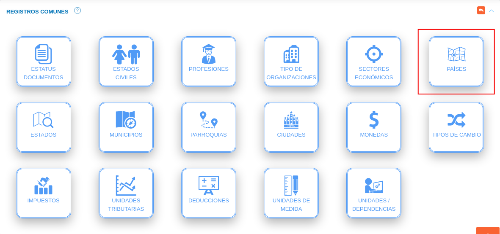
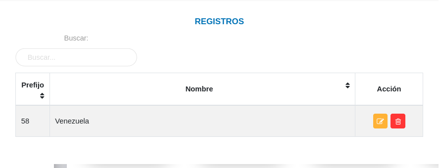
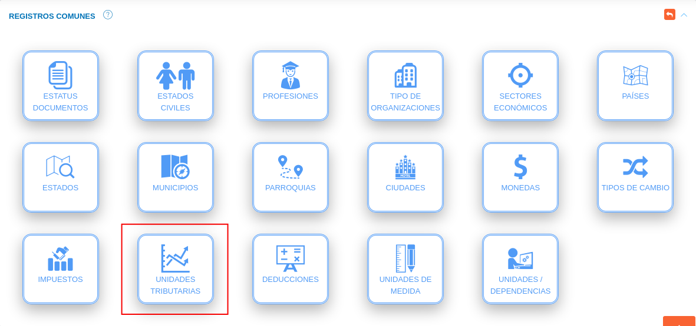

#Configuración General del Sistema  
**********************************

## Parámetros generales

A través de la sección parámetros generales, el usuario ***Administrador*** o algún otro usuario con permisos especiales sobre la **Configuración** del sistema puede habilitar o deshabilitar funcionalidades para la aplicación (Figura 10). A continuación se listan las funcionalidades a gestionar a través de la configuración de parámetros generales. 

**Funcionalidades**: 

- **Notificaciones**: Mediante esta funcionalidad el sistema activa las notificaciones de la aplicación.

- **Banner en reportes**: Activa el uso de banner para reportes emitidos por el sistema. Para su correcto funcionamiento es necesario añadir un banner en la configuración de la organización usuaria.  

- **Multi gestión**: Mediante esta funcionalidad el sistema activa la gestión administrativa para el uso de múltiples organizaciones.

- **Firma electrónica**: Mediante esta funcionalidad el sistema activa la firma electrónica para todos los procesos del sistema.
### Activar funcionalidades

Para activar funcionalidades de la aplicación se deben seguir los siguientes pasos: 

***Usuario Administrador***

-   Acceder al sistema e iniciar sesión con usuario y contraseña.
-   Ingresar a través del panel lateral a **Configuración** > **General** y ubicarse en la sección **Parámetros Generales** (ver Figura).

Figura 10: Parámetros Generales

-   Indique la opción  del botón de selección de las funcionalidades que desee habilitar. 
-   Presione el botón **Guardar**   para registrar los cambios efectuados.
-   Presione el botón **Cancelar**   para cancelar registro y regresar a la ruta anterior.
-   Presione el botón **Borrar**  para eliminar datos del formulario.
-   Si desea recibir ayuda guiada presione el botón .
-   Para retornar a la ruta anterior presione el botón .

## Registros comunes

La sección de registros comunes es una herramienta de la **Configuración** que permite al usuario administrador o un usuario con permisos sobre la **Configuración** ajustar a través de parámetros preestablecidos, el sistema a la organización usuaria.   Los datos registrados en esta sección serán considerados en todo el sistema.

### Establecer registros comunes

Para establecer registros comunes se deben seguir los siguientes pasos: 

***Usuario Administrador***

-   Acceder al sistema e iniciar sesión con usuario y contraseña.
-   Ingresar a través del panel lateral a **Configuración** > **General** y ubicarse en la sección **Registros Comunes** (ver Figura).

Figura 11: Registros Comunes

**Estatus documentos**

-   Ingresar a la opción **Estatus documentos** dando clic sobre el recuadro. 

Figura: Registros Comunes Estatus Documentos

***Registro de estatus de documento***

-   Complete el formulario **Estatus de Documento** (ver Figura).   Seleccione un color dando clic sobre el recuadro del campo **Color**, asigne un nombre y descripción para el proceso en que se encuentra el documento a través de los campos **Nombre** y **Descripción** respectivamente, seleccione una acción que ejecuta a través del botón de selección . 
-   Presione el botón  **Guardar** para registrar los cambios efectuados.
-   Presione el botón  **Cancelar** para limpiar datos del formulario.
-   Presione el botón  **Cerrar** para cerrar el formulario.

Figura: Formulario Estatus De Documento

***Gestión de registros***

-   Para editar un registro de **estatus de documento** presione el botón **Editar**  del registro seleccionado de la tabla **Registros**.  A continuación complete el formulario **Estatus De Documento** y presione el botón **Guardar** para almacenar los cambios efectuados.
-   Para eliminar un registro de **estatus de documento** presione el botón **Eliminar**  del registro seleccionado de la tabla **Registros**. 

Figura: Registros Estatus De Documento

**Estados civiles**

-   Ingresar a la opción **Estados civiles** dando clic sobre el recuadro. 

Figura: Registros Comunes Estados Civiles

***Registro de estados civiles***

-   Complete el formulario **Estados Civiles** (ver Figura). Asigne un nombre para el estado civil a registrar a través del campo **Nombre**. 
-   Presione el botón  **Guardar** para registrar los cambios efectuados.
-   Presione el botón  **Cancelar** para limpiar datos del formulario.
-   Presione el botón  **Cerrar** para cerrar el formulario.

Figura: Formulario Estados Civiles

***Gestión de registros***

-   Para editar un registro de **estados civiles** presione el botón **Editar**  del registro seleccionado de la tabla **Registros**.  A continuación complete el formulario **Estados Civiles** y presione el botón **Guardar** para almacenar los cambios efectuados.
-   Para eliminar un registro de **estados civiles** presione el botón **Eliminar**  del registro seleccionado de la tabla **Registros**. 

Figura: Registros Estados Civiles

**Profesiones**

-   Ingresar a la opción **Profesiones** dando clic sobre el recuadro. 

Figura: Registros Comunes Profesiones

***Registro de profesiones***

-   Complete el formulario **Profesiones** (ver Figura). Asigne un acrónimo(abreviatura) y nombre para la profesión a registrar. 
-   Presione el botón  **Guardar** para registrar los cambios efectuados.
-   Presione el botón  **Cancelar** para limpiar datos del formulario.
-   Presione el botón  **Cerrar** para cerrar el formulario.

Figura: Formulario Estados Civiles

***Gestión de registros***

-   Para editar un registro de **profesiones** presione el botón **Editar**  del registro seleccionado de la tabla **Registros**.  A continuación complete el formulario **Profesiones** y presione el botón **Guardar** para almacenar los cambios efectuados.
-   Para eliminar un registro de **profesiones** presione el botón **Eliminar**  del registro seleccionado de la tabla **Registros**. 

Figura: Registros Estados Civiles

**Tipo de organización**

-   Ingresar a la opción **tipo de organización** dando clic sobre el recuadro. 

Figura: Registros Comunes Tipo de Organización

***Registro de tipo de organización***

-   Complete el formulario **Tipo de Organización** (ver Figura). Asigne un acrónimo(abreviatura) y nombre para el tipo de organización a registrar. 
-   Presione el botón  **Guardar** para registrar los cambios efectuados.
-   Presione el botón  **Cancelar** para limpiar datos del formulario.
-   Presione el botón  **Cerrar** para cerrar el formulario.

Figura: Formulario Tipo de Organización

***Gestión de registros***

-   Para editar un registro de **tipo de organización** presione el botón **Editar**  del registro seleccionado de la tabla **Registros**.  A continuación complete el formulario **Tipo de Organización** y presione el botón **Guardar** para almacenar los cambios efectuados.
-   Para eliminar un registro de **tipo de organización** presione el botón **Eliminar**  del registro seleccionado de la tabla **Registros**. 

Figura: Registros Tipo de Organización

**Sectores económicos**

-   Ingresar a la opción **Sectores Económicos** dando clic sobre el recuadro. 

Figura: Registros Comunes Sectores Económicos

***Registro de sector económico***

-   Complete el formulario **Sector Económico** (ver Figura). Asigne un nombre para el sector económico a registrar. 
-   Presione el botón  **Guardar** para registrar los cambios efectuados.
-   Presione el botón  **Cancelar** para limpiar datos del formulario.
-   Presione el botón  **Cerrar** para cerrar el formulario.

Figura: Formulario Sector Económico

***Gestión de registros***

-   Para editar un registro de **sector económico** presione el botón **Editar**  del registro seleccionado de la tabla **Registros**.  A continuación complete el formulario **Sector Económico** y presione el botón **Guardar** para almacenar los cambios efectuados.
-   Para eliminar un registro de **sector económico** presione el botón **Eliminar**  del registro seleccionado de la tabla **Registros**. 

Figura: Registros Sector Económico

**Países**

-   Ingresar a la opción **Países** dando clic sobre el recuadro. 

Figura: Registros Comunes Países

***Registro de países***

-   Complete el formulario **País** (ver Figura). Asigne un acrónimo(código de área) y nombre del país a registrar.
-   Presione el botón  **Guardar** para registrar los cambios efectuados.
-   Presione el botón  **Cancelar** para limpiar datos del formulario.
-   Presione el botón  **Cerrar** para cerrar el formulario.

Figura: Formulario Países

***Gestión de registros***

-   Para editar un registro de **país** presione el botón **Editar**  del registro seleccionado de la tabla **Registros**.  A continuación complete el formulario **País** y presione el botón **Guardar** para almacenar los cambios efectuados.
-   Para eliminar un registro de **país** presione el botón **Eliminar**  del registro seleccionado de la tabla **Registros**. 

Figura: Registros Países

**Estados**

-   Ingresar a la opción **Estados** dando clic sobre el recuadro. 

Figura: Registros Comunes Estados

***Registro de estados***

-   Complete el formulario **Estados** (ver Figura).    Seleccione un país asociado, asigne un código y nombre del estado a registrar.
-   Presione el botón  **Guardar** para registrar los cambios efectuados.
-   Presione el botón  **Cancelar** para limpiar datos del formulario.
-   Presione el botón  **Cerrar** para cerrar el formulario.

**Municipios**

Figura: Registros Comunes Municipios

**Parroquias**

Figura: Registros Comunes Parroquias

**Ciudades**

Figura: Registros Comunes Ciudades

**Monedas**

Figura: Registros Comunes Monedas

**Tipos de cambio**

Figura: Registros Comunes Tipos de Cambio

**Impuestos**

Figura: Registros Comunes Impuestos

**Unidades tributarias**

Figura: Registros Comunes Unidades Tributarias

**Deducciones**

Figura: Registros Comunes Deducciones

**Unidades de medida**

Figura: Registros Comunes Unidades de Medida

**Unidades/Dependencias**

Figura: Registros Comunes Unidades de Medida

## Configurar organización 

Para iniciar el registro de una organización se deben seguir los siguientes pasos: 

***Usuario Administrador***

-   Acceder al sistema e iniciar sesión con usuario y contraseña.
-   Ingresar a través del panel lateral a **Configuración** > **General** y ubicarse en la sección **Configurar Organización** (ver Figura).

Figura : Configurar Organización

#### Logotipo y banner institucional

-   Para establecer un logotipo y banner institucional haga clic sobre los recuadros correspondientes que tienen por titulo **IMAGEN** (ver Figura).
-   Seleccione un archivo desde su directorio local (ver Figura ).  

Figura : Seleccionar Logotipo y Banner Institucional desde Directorio Local

Los logotipos y banners son añadidos en algunas secciones del sistema e incluidos en los formatos de archivos PDF emitidos desde la aplicación.   

Figura : Logotipo y Banner Institucional

#### Datos básicos

-   Complete el formulario del apartado **Datos Básicos**. Tenga en consideración completar los campos obligatorios que son requeridos para el registro de una institución.

!!! note "Nota"
    Los campos de selección del apartado **Datos básicos** incluyen información configurada previamente a través de los registros comunes del sistema. Si se requiere incluir información diferente a la que se encuentra por defecto se recomienda agregar estos registros en la configuración de registros comunes. 

    Para agregar registros comunes acceda a **Configuración** > **General** > **Registros Comunes**. 

    

    -   ***País***: Para crear un nuevo registro de país acceda a **Configuración** > **General** > **Registros Comunes** > **Países**. 
    -   ***Estado***: Para crear un nuevo registro de estado acceda a **Configuración** > **General** > **Registros Comunes** > **Estados**. 
    -   ***Municipio***: Para crear un nuevo registro de municipio acceda a **Configuración** > **General** > **Registros Comunes** > **Municipios**. 
    -   ***Ciudad***: Para crear un nuevo registro de ciudad acceda a **Configuración** > **General** > **Registros Comunes** > **Ciudades**.
    -   ***Adscrito a***: Para crear un nuevo registro de dependencia acceda a **Configuración** > **General** > **Registros Comunes** > **Unidades/ Dependencias**. 
    -   ***Sector***: Para crear un nuevo registro de sector económico acceda a **Configuración** > **General** > **Registros Comunes** > **Sectores Económicos**.
    -   ***Tipo***: Para crear un nuevo registro de tipo de organización acceda a **Configuración** > **General** > **Registros Comunes** > **Tipos de organizaciones**.
     

Figura : Datos Básicos de la Organización

#### Datos complementarios

-   Complete el formulario del apartado **Datos Complementarios**. Tenga en cuenta que todos los campos de este apartado no son obligatorios, por lo que no se requiere agregar información de forma obligatorio para completar el registro de una organización.

Figura : Datos Complementarios de la Organización

- Presione el botón **Guardar**   para registrar los cambios efectuados.
- Presione el botón **Cancelar**   para cancelar registro y regresar a la ruta anterior.
- Presione el botón **Borrar**  para eliminar datos del formulario.
- Si desea recibir ayuda guiada presione el botón .
- Para retornar a la ruta anterior presione el botón .

### Editar organización 

!!! note "Nota"
    Los pasos que se describen a continuación para la actualización de datos de una organización son válidos solo cuando existe el registro de una sola organización y la opción **multi gestión** del sistema se encuentra desactivada. 

    Para más información consule el apartado [Multi gestion](#multi-gestion) de este manual.

Para actualizar los datos de una organización registrada se requiere seguir lo siguientes pasos:

-   Ingresar a través del panel lateral a **Configuración** > **General** y ubicarse en la sección **Configurar Organización** (ver Figura).

Figura : Editar Organización

-   Actualice los datos del formulario siguiendo los pasos descritos en el apartado [Registrar organizacion](#logotipo-y-banner-institucional).
-   Presione el botón **Guardar**   para registrar los cambios efectuados.

### Multi gestión

El sistema KAVAC incorpora la gestión de multiples organizaciones desde una misma instancia.  Esta funcionalidad permite la integración entre organizaciones, abriendo paso a la gestión y control sobre recursos organizacionales y automatizando las transacciones entre dos o más organizaciones. 

Esta funcionalidad se encuentra desactivada por defecto, para activar dicha funcionalidad se requiere seguir los siguientes pasos: 

-   Ingresar a través del panel lateral a **Configuración** > **General** y ubicarse en la sección **Parámetros Generales** (ver Figura).

Figura : Habilitar Opción Multi-Gestión

-   Indique la opción  del botón de selección del campo **Multi gestión** para habilitar la gestión de multiples organizaciones. 
- Presione el botón **Guardar**   para registrar los cambios efectuados.
- Presione el botón **Cancelar**   para cancelar registro y regresar a la ruta anterior.
- Presione el botón **Borrar**  para eliminar datos del formulario.
- Si desea recibir ayuda guiada presione el botón .
- Para retornar a la ruta anterior presione el botón .

### Gestionar organizaciones

La gestión de organizaciones se lleva a cabo a través del apartado **Organizaciones Registradas**, este apartado se encuentra disponible si la opción [Multi gestión](#multi-gestion) se encuentra activa.  

-   Para acceder a esta sección debe dirigirse a **Configuración** > **General** y ubicarse en la sección **Registrar Organización** apartado **Organizaciones Registradas** (ver Figura).

A través del apartado **Organizaciones Registradas** se listan los registros de **Organizaciones** en una tabla que incluye los siguientes datos: **Logo**, **R.I.F**, **Código ONAPRE**, **Nombre** y **Estatus**.   

Desde este apartado se pueden llevar a cabo las siguientes acciones: 

-   ***Registrar organización***.   
-   ***Consular registros***.
-   ***Editar registros***. 

Figura : Organizaciones Registradas

#### Registrar organización

-   Presione el botón **Crear registro**  ubicado en la parte superior derecha del apartado **Organizaciones Registradas** (ver Figura )
-   A continuación complete el formulario siguiendo los pasos descritos en el apartado [Registrar organizacion](#logotipo-y-banner-institucional).

Figura : Registrar Organización / Multi-Gestión Activa

#### Consular registros

-   Presione el botón **Consultar registro**  ubicado en la columna titulada **Acción** de un registro de organización que se prefiere consultar. 

Figura : Consular Registros de Organizaciones / Multi-Gestión Activa

-   A continuación el sistema despliega una sección donde se describen los datos de la organización seleccionada. 

Figura : Datos de la Organización

#### Editar registros

-   Presione el botón **Editar registro**   ubicado en la columna titulada **Acción** del registro de organización que se desee seleccionar para actualizar datos. 
-   Actualice los datos del formulario siguiendo los pasos descritos en el apartado [Registrar organizacion](#logotipo-y-banner-institucional).
-   Presione el botón **Guardar**   para registrar los cambios efectuados.

Figura : Editar Registros de Organizaciones/ Multi-Gestión Activa

