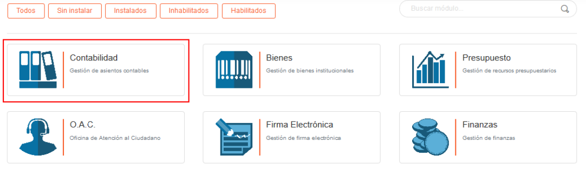

# Configuración de Módulos del Sistema 
**************************************

## Módulos
 
KAVAC como sistema de Planificación de Recursos Empresariales (ERP), se compone de herramientas que facilitan la gestión administrativa en todos los departamentos de una organización.  Los módulos del sistema conviven entre sí para proveer diferentes funcionalidades a cada departamento; aun así, el sistema está diseñado con el objetivo de garantizar independencia entre los módulos, en tal sentido, no afecta la incorporación o desincorporación de alguno de los módulos.

A continuación se describe los pasos pasos a seguir para la gestión de módulos:

## Gestión de módulos 

***Usuario Administrador***

-   Acceder al sistema e iniciar sesión con usuario y contraseña.
-   Ingresar a través del panel lateral a **Configuración** > **Módulos** (ver Figura).
-   A través de esta sección es posible filtrar la lista de módulos por las siguientes opciones: **Todos**, **Sin Instalar**, **Instalados**, **Inhabilitados** y **Habilitados**.   

Figura 18: Gestión de Aplicaciones

-   Haga clic sobre el módulo que desea gestionar.

Figura 18: Gestión de Aplicación

Ejemplo módulo de Bienes (Figura 19)

Figura 19: Gestión Módulo de Bienes

