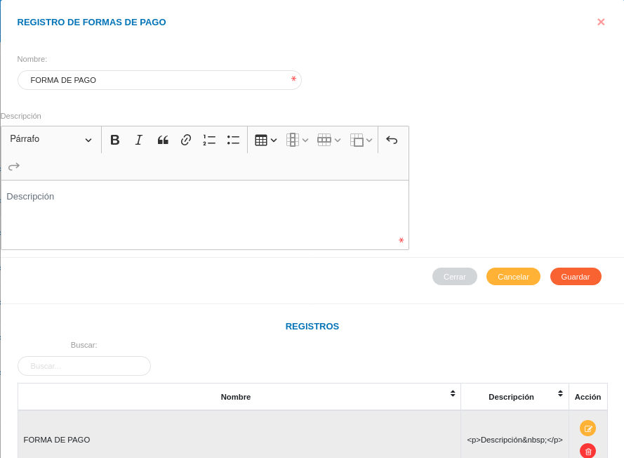

# Configuración Registros Comunes Módulo de Finanzas
****************************************************

## Formas de pago

A través de esta funcionalidad se gestionan las formas de pago a emplear en los procesos financieros por parte de la organización usuaria.   

Registro de fomas de pago: 

- Dirigirse a la **Configuración** del módulo de **Finanzas**.
- Ingresar a la opción **Formas de Pago** ubicada en la sección **Registros Comunes**.
- Completar el formulario **Formas de Pago**.   
- Presionar el botón **Guardar** y verificar que se haya almacenado en la lista de registros. 

Figura 11: Formulario Formas de Pago

    
Gestión de registros: 

Para **Editar** o **Eliminar** un registro se debe hacer uso de los botones ubicados en la columna titulada **Acción** de la tabla de **Registros**.

