# Configuración General Módulo de Finanzas
******************************************

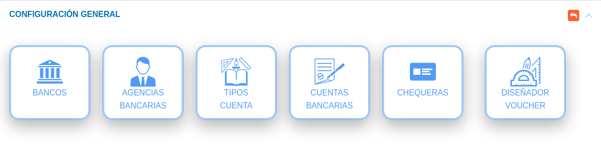
Figura 1: Configuración General

## Bancos

A través de esta sección se gestionan los diferentes registros de entidades bancarias. El sistema KAVAC incorpora por defecto una serie de entidades bancarias registradas en Venezuela.   

Crear registro de entidad bancaria: 

- Dirigirse a la **Configuración** del módulo de **Finanzas**.
- Ingresar a la opción **Bancos** ubicada en la sección **Configuración General**.
- Completar el formulario **Bancos**.   
- Presionar el botón **Guardar** y verificar que se haya almacenado en la lista de registros. 

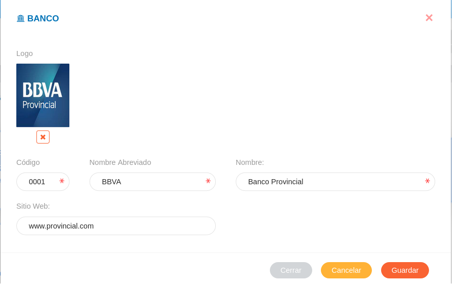
Figura 2 : Formulario de Entidades Bancarias

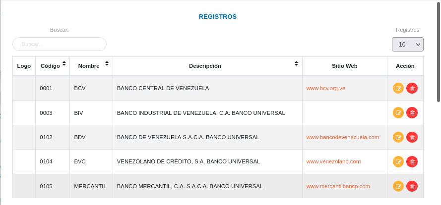
Figura 3: Registros de Entidades Bancarias

Gestión de registros: 

Para **Editar** o **Eliminar** un registro se debe hacer uso de los botones ubicados en la columna titulada **Acción** de la tabla de **Registros**.

 

## Agencias bancarias 

A través de esta sección se gestionan agencias bancarias asociadas a una entidad bancaria previamente registrada.    

Crear registro de agencia bancaria: 

- Dirigirse a la **Configuración** del módulo de **Finanzas**.
- Ingresar a la opción **Agencias Bancarias ** ubicada en la sección **Configuración General**.
- Completar el formulario **Agencias Bancarias**.   
- Presionar el botón **Guardar** y verificar que se haya almacenado en la lista de registros. 

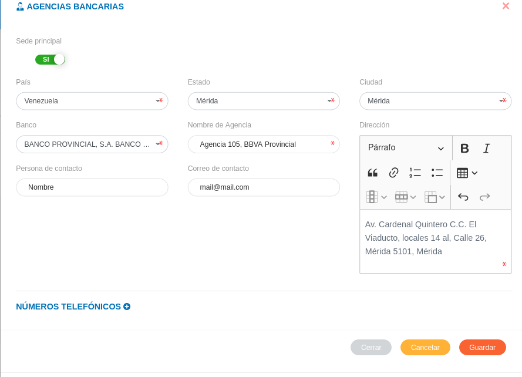
Figura 4: Formulario de Agencias Bancarias 

!!! note "Números Telefónicos"
    Presionar el botón **Agregar números telefónicos** para añadir un nuevo registro de contacto.
    
     
    
    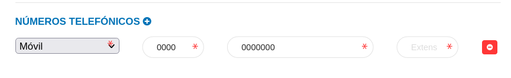

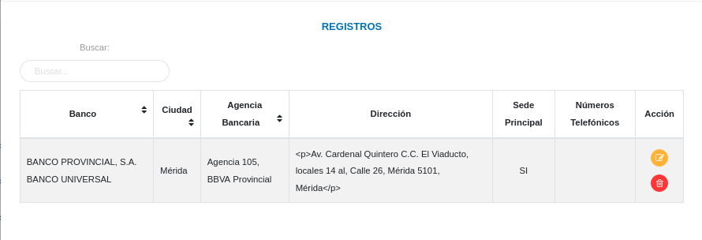
Figura 5: Registros de Agencias Bancarias

Gestión de registros: 

Para **Editar** o **Eliminar** un registro se debe hacer uso de los botones ubicados en la columna titulada **Acción** de la tabla de **Registros**.

 

## Tipos de cuenta

A través de esta sección se gestionan los diferentes tipos de cuentas que administra la organización usuaria.   

Crear registro de tipo de cuenta: 

- Dirigirse a la **Configuración** del módulo de **Finanzas**.
- Ingresar a la opción **Tipos de Cuenta** ubicada en la sección **Configuración General**.
- Completar el formulario **Tipo de Cuenta**.   
- Presionar el botón **Guardar** y verificar que se haya almacenado en la lista de registros. 

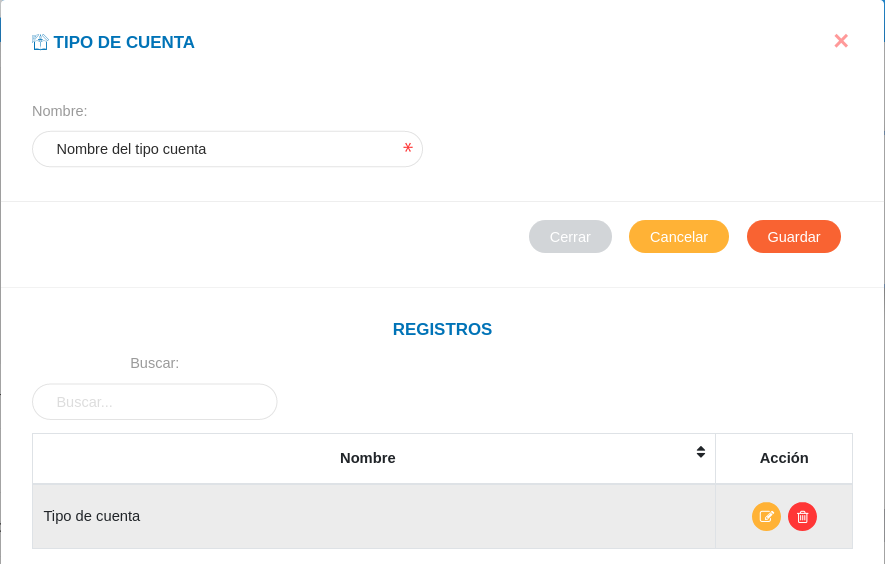
Figura 6: Formulario Tipo de Cuenta

Gestión de registros: 

Para **Editar** o **Eliminar** un registro se debe hacer uso de los botones ubicados en la columna titulada **Acción** de la tabla de **Registros**.

 

## Cuentas bancarias 

A través de esta sección se gestionan cuentas bancarias que administra la organización usuaria.   

Crear registro de cuenta bancaria: 

- Dirigirse a la **Configuración** del módulo de **Finanzas**.
- Ingresar a la opción **Cuentas Bancarias** ubicada en la sección **Configuración General**.
- Completar el formulario **Cuenta bancaria**.   
- Presionar el botón **Guardar** y verificar que se haya almacenado en la lista de registros. 

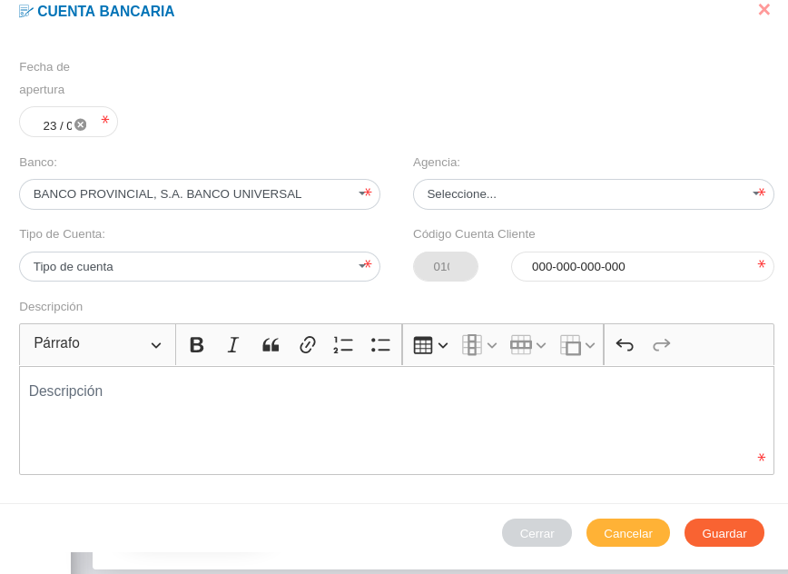
Figura 7: Formulario Cuenta Bancaria

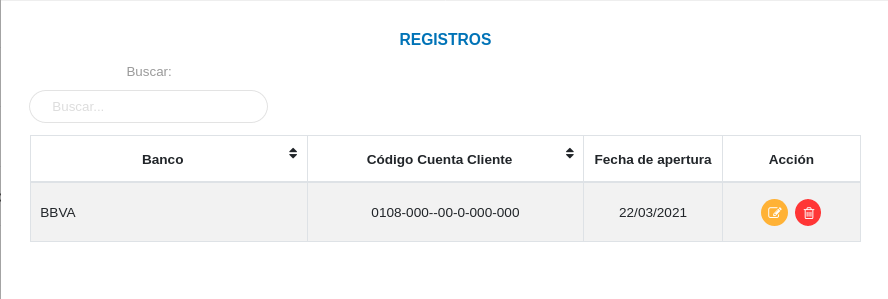
Figura 8: Registros Cuentas Bancarias

Gestión de registros: 

Para **Editar** o **Eliminar** un registro se debe hacer uso de los botones ubicados en la columna titulada **Acción** de la tabla de **Registros**.

## Chequeras

A través de esta sección se gestionan los registros de chequeras que administra la organización usuaria.   

Crear registro de chequera: 

- Dirigirse a la **Configuración** del módulo de **Finanzas**.
- Ingresar a la opción **Chequeras** ubicada en la sección **Configuración General**.
- Completar el formulario **Chequera**.   
- Presionar el botón **Guardar** y verificar que se haya almacenado en la lista de registros. 

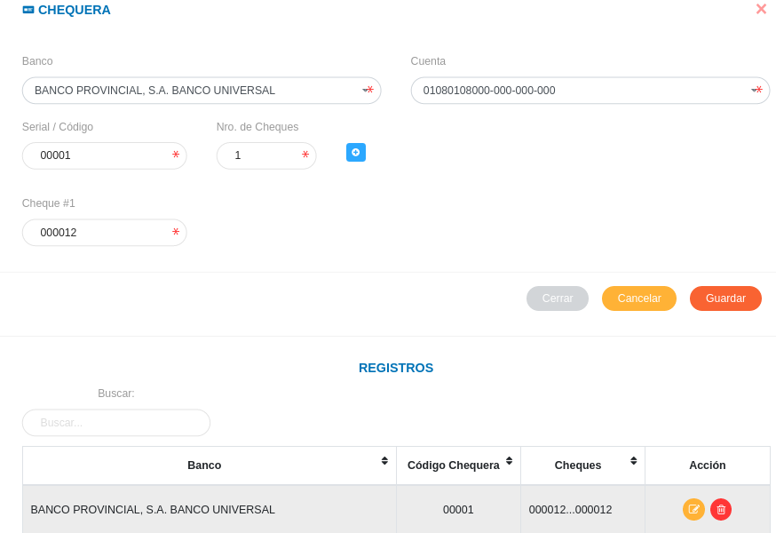
Figura 9: Formulario de Chequeras

!!! note "Agregar código de cheques"
    Presionar el botón **Agregar** para añadir un código a cada cheque registrado en la chequera en gestión.
    
     
    
Gestión de registros: 

Para **Editar** o **Eliminar** un registro se debe hacer uso de los botones ubicados en la columna titulada **Acción** de la tabla de **Registros**.

## Diseñador voucher 

Esta funcionalidad permite al analista de finanzas o usuario con permisos especiales sobre el módulo realizar el diseño de vouchers adaptado a las necesidades de la organización usuaria.    

Diseño de voucher: 

- Dirigirse a la **Configuración** del módulo de **Finanzas**.
- Ingresar a la opción **Diseñador Voucher** ubicada en la sección **Configuración General**.
- Crear diseño de voucher.   
- Presionar el botón **Guardar** y verificar que se haya almacenado en la lista de registros. 

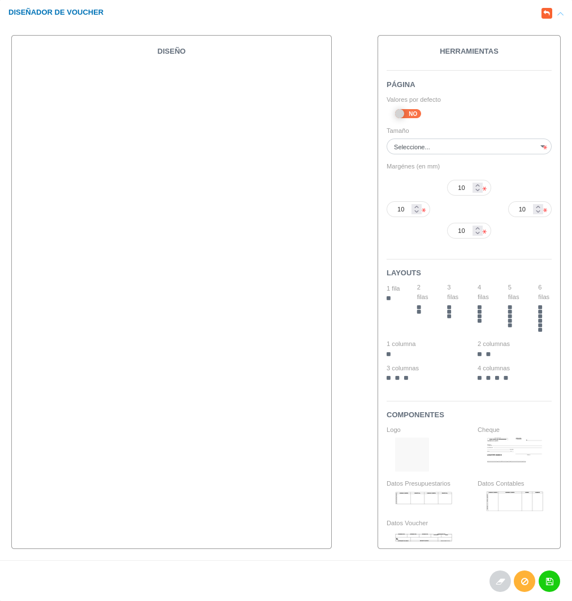
Figura 10: Diseño de Voucher

    
Gestión de registros: 

Para **Editar** o **Eliminar** un registro se debe hacer uso de los botones ubicados en la columna titulada **Acción** de la tabla de **Registros**.

